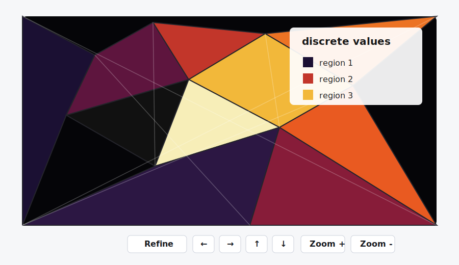

# AdaptiveSampling.jl

AdaptiveSampling.jl adaptively samples expensive functions over a two-dimensional
parameter window and visualizes the result with GLMakie. It is designed for
parameter landscapes where most regions are boring, but boundary regions or
jump loci deserve more samples.



The current implementation is triangulation-native: it stores a Delaunay
triangulation, a cache of oracle values at sampled points, and the set of
triangles still considered incomplete. Refinement inserts new points only into
incomplete triangles, using incremental Delaunay updates.

## Installation

From a Julia REPL in this repository:

```julia
using Pkg
Pkg.activate(".")
Pkg.instantiate()
```

Then load the package:

```julia
using AdaptiveSampling
```

## Quick Start

```julia
using AdaptiveSampling

f(x, y) = x^2 + y^2 < 1 ? 1 : 2

VT, fig = visualize(f;
    xlims = [-2, 2],
    ylims = [-2, 2],
    total_resolution = 1000,
    strategy = :sierpinski,
    refine_button = true,
)
```

`visualize(f; ...)` returns both the `ValuedTriangulation` and the Makie figure.
It also displays the figure. The `Refine` button performs another refinement
pass, and the arrow/zoom buttons move around the parameter window while keeping
previously computed function values cached.

## Batched Oracles

The preferred oracle shape is batched:

```julia
f(points) = [p[1]^2 + p[2]^2 for p in points]
```

Single-point functions are also accepted:

```julia
f(point) = point[1]^2 + point[2]^2
g(x, y) = x^2 + y^2
```

Internally, single-point oracles are wrapped into batched calls. For expensive
applications, especially HomotopyContinuation.jl workflows, a real batched
oracle is usually much faster.

## Refinement


The main refinement strategies are:

- `:sierpinski`: add triangle edge midpoints that are not already cached.
- `:barycenter`: add the triangle barycenter.
- `:random`: add one random point inside the triangle.

By default, `refine!(VT)` performs one pass over visible incomplete triangles.
It skips triangles whose area is at or below
`VT.min_refinement_area * window_area`. The default normalized
`min_refinement_area` is `1e-4`.

To refine repeatedly until all remaining incomplete triangles are too small:

```julia
refine!(VT; by_min_area = 1e-5)
```

## Complete and Incomplete Triangles

A triangle is complete when its vertex values are consistent according to the
completeness predicate. The default predicate treats small finite value sets as
discrete and larger numeric value sets as continuous. You can pass your own:

```julia
same_parity(triangle, cache; kwargs...) = begin
    values = [cache[i][2] for i in triangle]
    all(iseven, values) || all(isodd, values)
end

VT = ValuedTriangulation(f; is_complete = same_parity)
```

The special value `:wildcard` is treated as compatible with every other value
for completeness. Triangles whose plotted value is unknown or all-wildcard are
drawn black.

## HomotopyContinuation.jl Use

A common use case is to count real solutions over a parameter plane. The helper
code in `test/HCtests.jl` shows one such workflow:

```julia
using LinearAlgebra
using HomotopyContinuation
using AdaptiveSampling

include("test/HCtests.jl")

F = TwentySevenLines()
real_line_count = real_solution_function(F)

VT, fig = visualize(real_line_count;
    xlims = [-5, 5],
    ylims = [-5, 5],
    total_resolution = 1000,
    initial_resolution_fraction = 0.10,
    strategy = :sierpinski,
    refine_button = true,
)
```

The oracle produced by `real_solution_function` is batched and passes a list of
target parameters directly to `solve`.

## API

The main user-facing functions are:

- `visualize(f; kwargs...)`
- `ValuedTriangulation(f; kwargs...)`
- `refine!(VT; kwargs...)`
- `complete_polygons(VT)`
- `incomplete_polygons(VT)`
- `is_discrete(function_cache)`
- `is_complete(triangle, function_cache; kwargs...)`
- `save(fig, filename; kwargs...)`

## License

AdaptiveSampling.jl is released under the MIT license.
