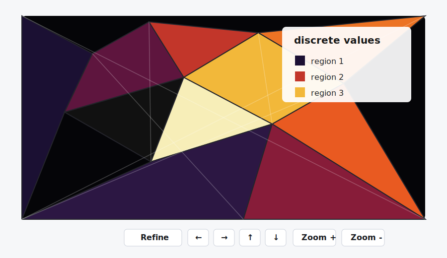
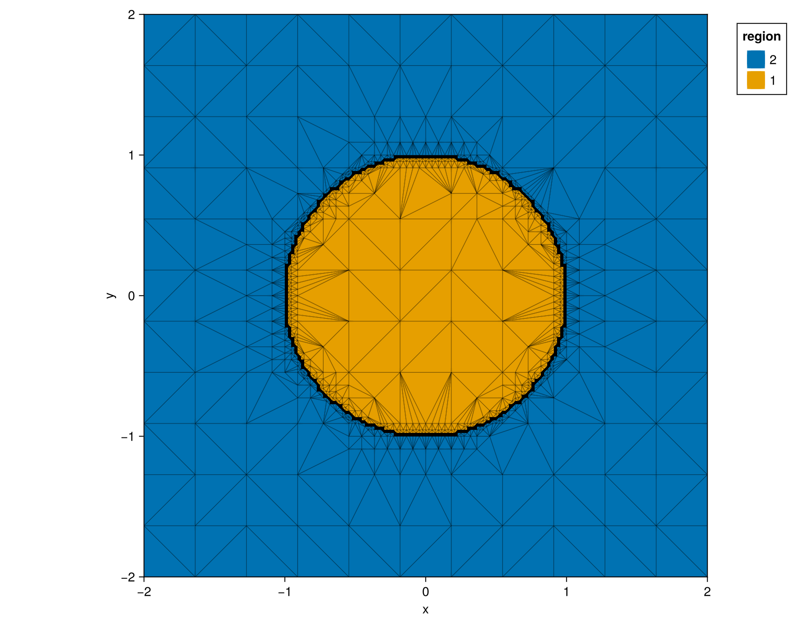
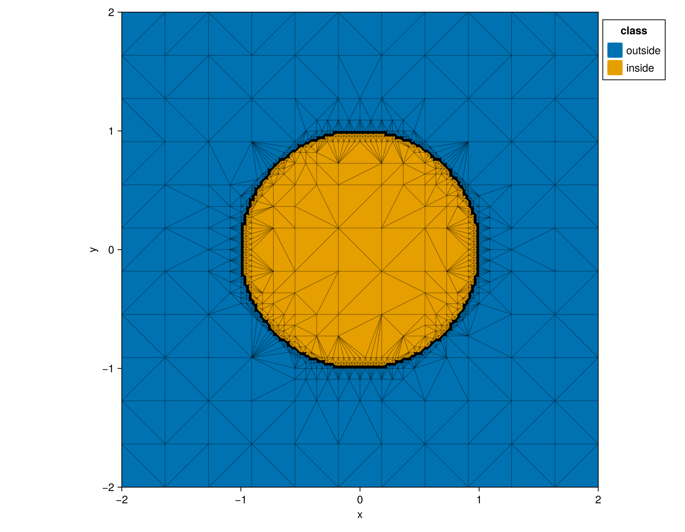
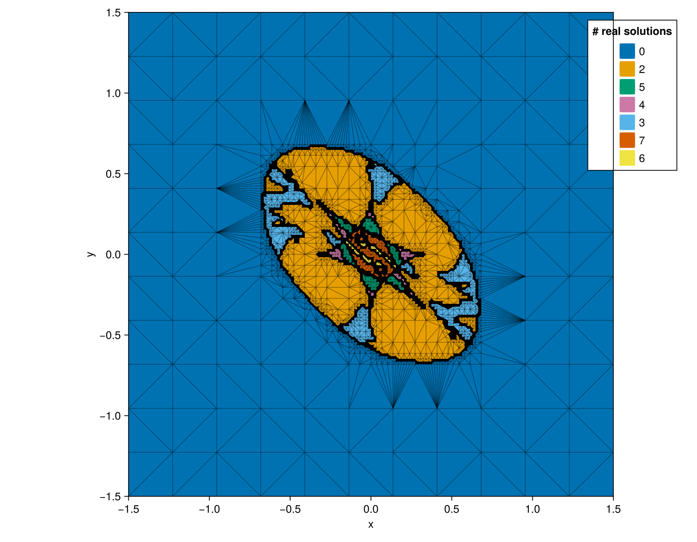
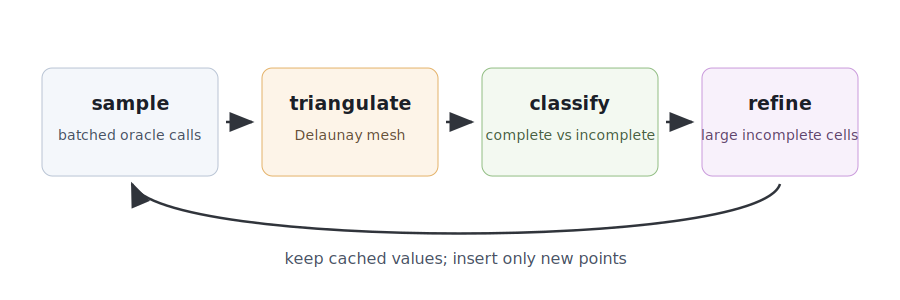

# AdaptiveVisualization.jl

AdaptiveVisualization.jl adaptively samples expensive functions over a two-dimensional
parameter window and visualizes the result with GLMakie. It is designed for
parameter landscapes where most regions are boring, but boundary regions or
jump loci deserve more samples.



The Delaunay triangulation stores sampled points and triangle connectivity,
`TriangulationCache` stores oracle values by vertex index, and
`incomplete_triangles` stores only the triangles still needing refinement.
Refinement inserts new points only into incomplete triangles, using incremental
Delaunay updates.

## Installation

From a Julia REPL in this repository:

```julia
using Pkg
Pkg.activate(".")
Pkg.instantiate()
```

Then load the package:

```julia
using AdaptiveVisualization
```

## Quick Start

```julia
using AdaptiveVisualization

f(x, y) = x^2 + y^2 < 1 ? 1 : 2

TC, fig = visualize(f;
    xlims = [-2, 2],
    ylims = [-2, 2],
    total_resolution = 1000,
    strategy = :sierpinski,
    refine_button = true,
)
```

`visualize(f; ...)` returns both the `TriangulationCache` and the Makie figure.
It also displays the figure. The `Refine` button performs another refinement
pass, and the arrow/zoom buttons move around the parameter window while keeping
previously computed function values available.

## Example Figures

The images below are generated by this package using five adaptive refinement
passes. To recreate them from this repository, run:

```julia
julia --project=. docs/make_readme_figures.jl
```

Individual figures can be regenerated by name, for example:

```julia
julia --project=. docs/make_readme_figures.jl kuramoto
```

The first example samples a disk indicator function. Triangle edges are drawn
thinly to show how refinement concentrates around the jump locus.



The same geometry also works for non-numeric oracle values. Here the oracle
returns `"inside"` or `"outside"`, and the categorical legend is generated from
the observed labels.



The next example uses HomotopyContinuation.jl to count real solutions of a
parametrized Kuramoto polynomial system over a two-parameter window. Black
triangles mark unresolved or mixed-value regions; repeated refinement resolves
more of the boundary.



## Batched Oracles

The preferred oracle shape is batched:

```julia
f(points) = [p[1]^2 + p[2]^2 for p in points]
```

Single-point functions are also accepted:

```julia
f(point) = point[1]^2 + point[2]^2
g(x, y) = x^2 + y^2
```

Internally, single-point oracles are wrapped into batched calls. For expensive
applications, especially HomotopyContinuation.jl workflows, a real batched
oracle is usually much faster.

## Refinement



The main refinement strategies are:

- `:sierpinski`: add triangle edge midpoints that are not already cached.
- `:barycenter`: add the triangle barycenter.
- `:random`: add one random point inside the triangle.

By default, `refine!(TC)` performs one pass over visible incomplete triangles.
It skips triangles whose area is at or below
`TC.min_refinement_area * window_area`. The default normalized
`min_refinement_area` is `1e-4`.

To refine repeatedly until all remaining incomplete triangles are too small:

```julia
refine!(TC; by_min_area = 1e-5)
```

## Complete and Incomplete Triangles

A triangle is complete when its vertex values are consistent according to the
completeness predicate. Custom predicates receive the triangle vertices and the
three corresponding function values:

```julia
same_parity(vertices, values; kwargs...) = begin
    all(iseven, values) || all(isodd, values)
end

TC = TriangulationCache(f; is_complete = same_parity)
```

Here `vertices` is an `NTuple{3,NTuple{2,Float64}}`, and `values` is a vector
of the three oracle values at those vertices.

The default predicate treats non-real values as discrete, regardless of how many
distinct values are present. Discrete triangles are complete when all
non-`:wildcard` values are equal. Numeric triangles use a tolerance derived from
the global range of sampled real values. The special value `:wildcard` is
treated as compatible with every other value for completeness.

For plotting, numeric complete triangles are colored by the average of their
non-wildcard vertex values. Non-real complete triangles are colored by their
shared category; if their non-wildcard values are not equal, plotting raises an
error because there is no unambiguous category to draw. Triangles whose plotted
value is unknown or all-wildcard are drawn black.

## HomotopyContinuation.jl Use

A common use case is to count real solutions over a parameter plane. The helper
code in `test/HCtests.jl` shows one such workflow:

```julia
using LinearAlgebra
using HomotopyContinuation
using AdaptiveVisualization

include("test/HCtests.jl")

F = TwentySevenLines()
real_line_count = real_solution_function(F)

TC, fig = visualize(real_line_count;
    xlims = [-5, 5],
    ylims = [-5, 5],
    total_resolution = 1000,
    strategy = :sierpinski,
    refine_button = true,
)
```

The oracle produced by `real_solution_function` is batched and passes a list of
target parameters directly to `solve`.

The README figure generator includes this Kuramoto system:

```julia
function KuramotoModel(n)
    @var w[1:(n-1)], s[1:n], c[1:n]
    equations = []
    for i in 1:(n-1)
        coupling_sum = 0
        for j in 1:n
            coupling_sum += s[i] * c[j] - s[j] * c[i]
        end
        f_1 = w[i] - (1 / n) * coupling_sum
        f_2 = c[i]^2 + s[i]^2 - 1
        f_1 = subs(f_1, [s[n], c[n]] => [0, 1])
        f_2 = subs(f_2, [s[n], c[n]] => [0, 1])
        f_1 == 0 || push!(equations, f_1)
        f_2 == 0 || push!(equations, f_2)
    end
    return System(equations;
        variables=[s[1:n-1]..., c[1:n-1]...],
        parameters=[w[1:n-1]...],
    )
end
```

For `n = 3`, the two plotted coordinates are the two parameters
`w[1]` and `w[2]`.

## API

The main user-facing functions are:

- `visualize(f; kwargs...)`
- `TriangulationCache(f; kwargs...)`
- `refine!(TC; kwargs...)`
- `complete_triangles(TC)`
- `incomplete_triangles(TC)`
- `is_discrete(function_values)`
- `is_complete(vertices, values; kwargs...)` for custom completeness predicates
- `save(fig, filename; kwargs...)`

## License

AdaptiveVisualization.jl is released under the MIT license.
